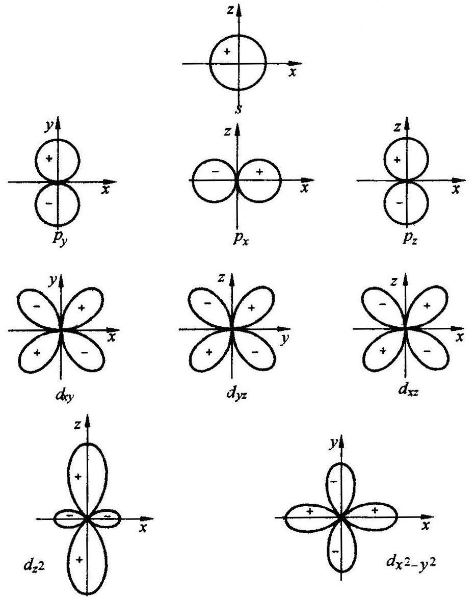
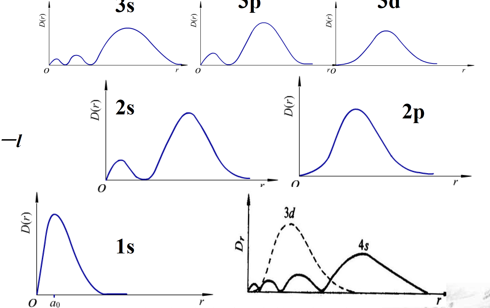
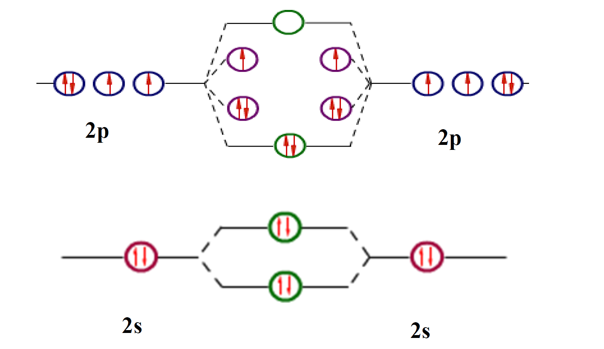
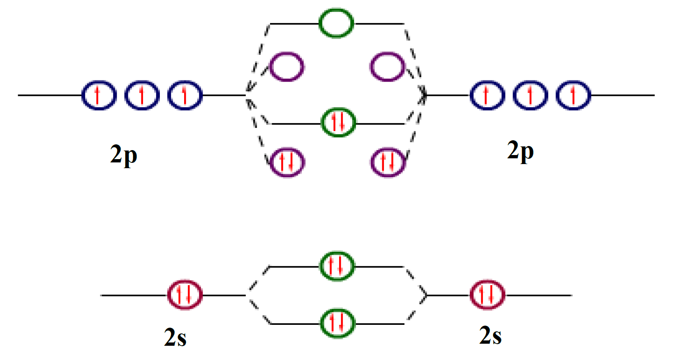
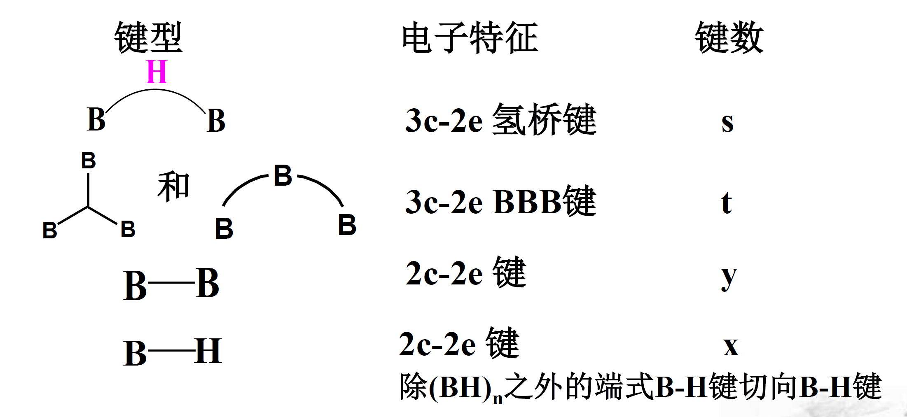
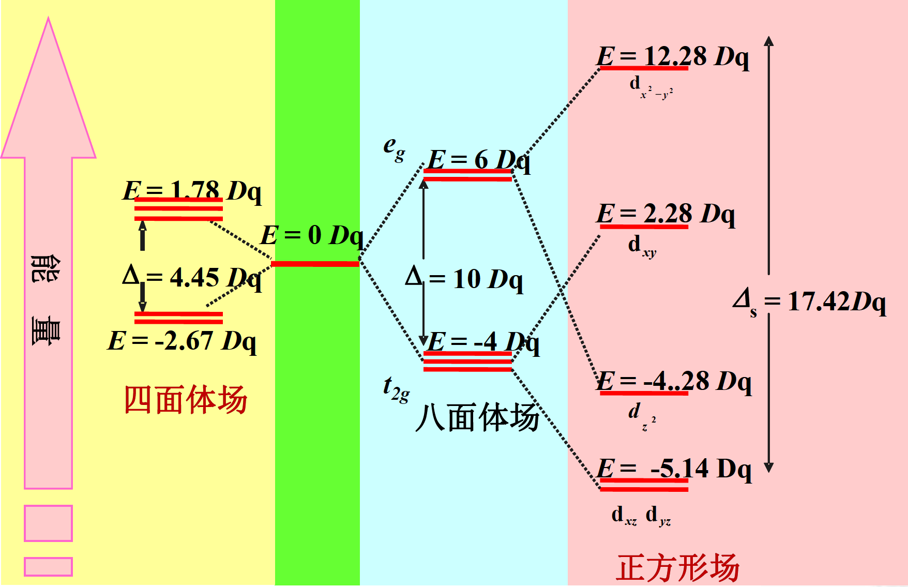

# 预科二 化学

## 第一章 原子结构与元素周期

### 1.1 玻尔原子轨道模型

Planck 方程：

$$E = h \nu$$

电子激发后发出的光频率满足

$$
\tilde\nu = R_\infty \left(\frac{1}{n_1^2} - \frac{1}{n_2^2}\right).
$$

### 1.2 波粒二象性

波函数 $\psi$ 代表体系运动状态，有正负，反映了波动性；$|\psi|^2$ 代表微粒在某位置中出现的概率密度。

经过极坐标变换及分离量子数后，波动方程变换为

$$
\psi_{n, l, m}(r, \theta, \phi) = R_{n, l}(r) \cdot Y_{l, m}(\theta, \phi).
$$

各个量子数的物理意义

::: large

| 参数       | 符号  | 含义                 | 取值                 |
| :--------- | :---- | :------------------- | :------------------- |
| 主量子数   | $n$   | 决定电子能级         | $n=1, 2, 3, \cdots$  |
| 角量子数   | $l$   | 决定电子能级的亚层   | $l=0, \cdots, (n-1)$ |
| 磁量子数   | $m$   | 决定电子云的空间取向 | $m=-l, \cdots, l$    |
| 自旋量子数 | $m_s$ | 描述电子自旋状态     | $m_s=\pm 1 / 2$      |

_角度分布 $Y(\theta, \phi)$_

_径向分布 $D(r)$_

$$
D(r)=4 \pi r^2 |R_{n,l}(r)|^2
$$

$$
N_{峰} = n - l
$$

### 1.3 屏蔽效应和钻穿效应

_屏蔽效应_：由于受到除自身以外电子的排斥，因此有效电荷小于核电荷。

$$
Z^\ast = Z - \sigma
$$

$\sigma$ 为屏蔽常数，遵循 Slater 规则。

> #### Slater 规则
>
> 可近似的用斯莱特法则将原子中的电子分成以下几组：
>
> $$
> (1\mathrm{s})(2\mathrm{s},2\mathrm{p})(3\mathrm{s},3\mathrm{p})(3\mathrm{d})(4\mathrm{s},4\mathrm{p})(4\mathrm{d})(4\mathrm{f})(5\mathrm{s},5\mathrm{p})(5\mathrm{d})(5\mathrm{f})(6\mathrm{s},6\mathrm{p})(6\mathrm{d})(6\mathrm{f})
> $$
>
> 1. 位于被屏蔽电子的右边的各组对被屏蔽电子的 $\sigma=0$，近似可以认为外层电子对内层电子没有屏蔽作用；
> 2. $1\mathrm{s}$ 轨道上的两个电子之间的 $\sigma=0.3$，其他同组电子之间的 $\sigma=0.35$，如 $(2\mathrm{s},2\mathrm{p})$ 之间的电子；
> 3. 被屏蔽的电子为 $n\mathrm{s}$ 或 $n\mathrm{p}$ 时，则主量子数 $(n-1)$ 的各电子对它们的 $\sigma=0.85$，而小于 $(n-1)$ 的各电子对它们的$\sigma=1$；
> 4. 被屏蔽的电子为 $n\mathrm{d}$ 或 $n\mathrm{f}$ 时，则位于它们左边各组电子对它们的的屏蔽常数 $\sigma=1$。
>
> 在计算某原子中某个电子的 $\sigma$ 值时，将有关屏蔽电子对该电子的 $\sigma$ 值相加而得。

$\sigma$ 越大，有效核电荷 $Z^\ast$ 越小，能量越高【能级交错】。类氢离子能量:

$$
E = -2.179 \times 10^{-18} \frac{(Z - \sigma)^2}{n^2} \mathrm{J}
$$

_钻穿效应_：屏蔽的程度还取决于电子离核距离，s 电子钻穿能力更强，s 轨道离核比 p 轨道更近，感受到更大的有效核电荷，因此被屏蔽得更少，因此能量也更低。

$n$ 相同时，$l$ 值越小，钻穿效应越明显，能量越低。【能级分裂，能级交错】

### 1.4 基态原子的核外电子排布

能量最低原理、泡利不相容原理、洪特定理及全满半满时的特例。

### 1.5 元素周期表

- 各周期元素个数: 2, 8, 8, 18, 18, 32, 32
- 族的划分: IA~VIIA, IB~VIIB, VIII ($(n-1)\mathrm{d}^{6\to8}n\mathrm{s}^2$)
- 区的划分: s 区 p 区—主族, d 区—过渡元素, ds 区—IB~IIB, f 区—镧系锕系

### 1.6 原子参数

1. _原子半径_：自左向右逐渐减少，主族元素减少快，过渡元素减少较慢，内过渡元素减少最慢；自上而下逐渐增大，少数例外。
   - 原因：长周期电子填入 $(n-1)\mathrm{d}$ 层或 $(n-2)$ 层，镧系锕系电子填入 $(n-1)\mathrm{f}$ 层（_镧系收缩_）。
2. _电离能_、_电子亲和能_：同周期从左向右逐渐增大，同族从上到小逐渐减小，部分因为全满半满电离能高于各自左右的元素。
3. _电负性_：主族中，自下而上、自左向右增大。

## 第二章 分子结构

### 2.1 价键理论

共价键：两个自旋方向相反的电子相互靠近，原子轨道重叠部分概率密度增大，对两个原子核产生了吸引。

键型：

::: whole

|   键类型    | 成键方式 | 原子轨道组合                                                                    |
| :---------: | :------: | :------------------------------------------------------------------------------ |
| $\sigma$ 键 |  头碰头  | $\mathrm{s} - \mathrm{s}$, $\mathrm{s} - \mathrm{p}$, $\mathrm{p} - \mathrm{p}$ |
|  $\pi$ 键   |  肩对肩  | $\mathrm{p} - \mathrm{p}$, $\mathrm{p} - \mathrm{d}$, $\mathrm{d} - \mathrm{d}$ |
| $\delta$ 键 |  面对面  | $\mathrm{d} - \mathrm{d}$                                                       |

杂化轨道：

::: whole

|        杂化轨道类型         | 轨道数目 |  几何构型  |   键角    |
| :-------------------------: | :------: | :--------: | :-------: |
|   $\mathrm{sp}$ 杂化轨道    |    2     |   直线形   |   180°    |
|  $\mathrm{sp^2}$ 杂化轨道   |    3     | 平面三角形 |   120°    |
|  $\mathrm{sp^3}$ 杂化轨道   |    4     | 正四面体形 |  109.5°   |
|  $\mathrm{sp^3d}$ 杂化轨道  |    5     |  三角双锥  | 90°, 120° |
| $\mathrm{sp^3d^2}$ 杂化轨道 |    6     |  正八面体  |    90°    |

### 2.2 VSEPR

$\ce{AB_n}$价层电子对数为

$$
N = \frac{1}{2}[\ce{A}的价电子数 + \ce{B}提供的价电子数 \pm 离子电荷数].
$$

每个配体 B 提供的电子数通常为 $1$ (H, X)，$0$ (O, S)。

孤对电子数为

$$
n = N - \ce{B}的个数
$$

|  VSEPR 类型  | 电子对的几何构型 |     分子的几何构型     |
| :----------: | :--------------: | :--------------------: |
|  $\ce{AX2}$  |      直线形      |         直线形         |
|  $\ce{AX3}$  |    平面三角形    |       平面三角形       |
| $\ce{AX2E}$  |    平面三角形    |      角形（V 形）      |
|  $\ce{AX4}$  |      四面体      |         四面体         |
| $\ce{AX3E}$  |      四面体      |         三角锥         |
| $\ce{AX2E2}$ |      四面体      |      角形（V 形）      |
|  $\ce{AX5}$  |     三角双锥     |        三角双锥        |
| $\ce{AX4E}$  |     三角双锥     | 变形四面体（跷跷板形） |
| $\ce{AX3E2}$ |     三角双锥     |          T 形          |
| $\ce{AX2E3}$ |     三角双锥     |         直线形         |
|  $\ce{AX6}$  |      八面体      |         八面体         |
| $\ce{AX5E}$  |      八面体      |         四方锥         |
| $\ce{AX4E2}$ |      八面体      |       平面正方形       |

### 2.3 分子轨道理论

$$
\ce{A + B -> AB}
\begin{cases}
\psi_{\mathrm{I}} = C_a \psi_A + C_b \psi_B \\
\psi_{\mathrm{II}} = C_a^\prime \psi_A + C_b^\prime \psi_B
\end{cases}
$$

1. 分子轨道由原子轨道线性组合而成，轨道数目不变；
2. 满足能量相近原则、最大重叠原理、对称性匹配原理；
3. 满足能量最低原理、泡利不相容原理和洪特定则。
4. 顺磁性：轨道中含有单电子的分子。  
   逆磁性：轨道中不含有单电子的分子。

$\ce{O2}$, $\ce{F2}$

$\ce{N2}$, $\ce{C2}$, $\ce{B2}$

$$
\begin{align*}
\ce{Li2}&\quad \mathrm{KK}  \sigma_{2\mathrm{s}}^2 \\
\ce{Be2}&\quad \mathrm{KK}  \sigma_{2\mathrm{s}}^2  \sigma_{2\mathrm{s}}^{*2} \\
\ce{B2}&\quad \mathrm{KK}  \sigma_{2\mathrm{s}}^2  \sigma_{2\mathrm{s}}^{*2}  \pi_{2\mathrm{p}_x}^1  \pi_{2\mathrm{p}_y}^1 \\
\ce{C2}&\quad \mathrm{KK}  \sigma_{2\mathrm{s}}^2  \sigma_{2\mathrm{s}}^{*2}  \pi_{2\mathrm{p}_x}^2  \pi_{2\mathrm{p}_y}^2 \\
\ce{N2}&\quad \mathrm{KK}  \sigma_{2\mathrm{s}}^2  \sigma_{2\mathrm{s}}^{*2}  \pi_{2\mathrm{p}_x}^2  \pi_{2\mathrm{p}_y}^2  \sigma_{2\mathrm{p}_z}^2 \\
\ce{O2}&\quad \mathrm{KK}  \sigma_{2\mathrm{s}}^2  \sigma_{2\mathrm{s}}^{*2}  \sigma_{2\mathrm{p}_z}^2  \pi_{2\mathrm{p}_x}^2  \pi_{2\mathrm{p}_y}^2  \pi_{2\mathrm{p}_x}^{*1}  \pi_{2\mathrm{p}_y}^{*1} \\
\ce{F2}&\quad \mathrm{KK}  \sigma_{2\mathrm{s}}^2  \sigma_{2\mathrm{s}}^{*2}  \sigma_{2\mathrm{p}_z}^2  \pi_{2\mathrm{p}_x}^2  \pi_{2\mathrm{p}_y}^2  \pi_{2\mathrm{p}_x}^{*2}  \pi_{2\mathrm{p}_y}^{*2} \\
\ce{Ne2}&\quad \mathrm{KK}  \sigma_{2\mathrm{s}}^2  \sigma_{2\mathrm{s}}^{*2}  \sigma_{2\mathrm{p}_z}^2  \pi_{2\mathrm{p}_x}^2  \pi_{2\mathrm{p}_y}^2  \pi_{2\mathrm{p}_x}^{*2}  \pi_{2\mathrm{p}_y}^{*2}  \sigma_{2\mathrm{p}_z}^{*2}
\end{align*}
$$

### 2.4 共轭 $\pi$ 键

1. 原子共平面，提供相同方向未成键的 p 轨道；
2. $\pi$ 电子数少于参与成键的 p 轨道数的两倍。

$$
\pi_m^n
$$

$m$ 为原子数目，$n$ 为电子数目。

> #### 硼烷
>
> 写作 $\ce{(BH)_nH_m}$
>
> 
>
> $$
> \begin{align*}
> x &= m-s\\
> t &= n-s\\
> y &= s-\frac{1}{2}m
> \end{align*}
> $$
>
> Wade 规则
>
> - 若 $b = n + 1$，那它是闭式结构；
> - 若 $b = n + 2$，那它是巢式结构；
> - 若 $b = n + 3$，那它是网式结构。

### 2.5 共价键参数

- _键级_：$键级 = \frac{1}{2}(城建轨道中的电子数 - 反键轨道中的电子数)$，键级越大，分子越稳定。
- _键能_：断裂时所需的能量大小。在气相中键断开时的标准摩尔焓成为键焓 $\Delta_\mathrm{B}H_\mathrm{m}^\ominus$。
- _键长_：成键两原子核间的平衡距离称为键长。键长一般随着原子半径的增大而增加，对于同一对原子形成的单键、双键和三键，键长依次减小。键长越短，键越强。
- _键角_：分子中两个化学键之间的夹角称为键角。
- _键矩_：衡量键极性的物理量，定义为：$\mu = q \cdot l$，$q$ 是电荷量，$l$ 是键长。

### 2.6 分子间作用力

1. _取向力_: 极性分子之间。偶极矩越大，取向力越大。
2. _诱导力_: 极性分子诱导周围分子极化，产生吸引力。偶极矩越大、分子变形性越打，诱导力越大。
3. _色散力_: 因正负电荷中心不重合产生的吸引力。分子结构越密实，色散力越小。

::: whole

| 分子类型              | 范德华力               |
| :-------------------- | :--------------------- |
| 极性分子-极性分子     | 取向力、诱导力、色散力 |
| 极性分子-非极性分子   | 诱导力、色散力         |
| 非极性分子-非极性分子 | 色散力                 |

范德华力越强，熔沸点越高。

### 2.7 氢键

饱和性+方向性

熔沸点、溶解性质、粘度和表面张力。

## 第三章 固体结构与金属键和离子键

### 3.1 晶格理论

金属晶体、离子晶体、原子晶体、分子晶体

### 3.2 金属晶体

电子海模型

金属离子 _排列越紧密、半径越小、离子电荷越高_，金属键越强，熔、沸点越高。

能带理论

1. 导带: 电子能够自由运动的能带。
2. 价带：金属最高全充满能带。
3. 禁带：价带与导带之间的区域。

### 3.3 离子晶体

没有方向性、饱和性。

3 种 $\ce{AB}$ 型离子晶体

::: whole

|      构型      | 配位数 | 正负离子半径之比 |
| :------------: | :----: | :--------------: |
| $\ce{ZnS}$ 型  |   4    |   0.225~0.414    |
| $\ce{NaCl}$ 型 |   6    |   0.414~0.732    |
| $\ce{CsCl}$ 型 |   8    |   0.732~1.000    |

_例外_: 离子极化导致键共价性增强，配位数减小。

晶格能 ($\Delta U$)：气态正负粒子形成 1 mol 固体离子化合物时放出的能量。正比于正负离子电荷数，反比于他们之间的距离 $r$。晶格能越高，熔点越高、硬度越大。

1. _极化力_: 使离子变形的能力大小。
   - 离子半径越小、电荷越多，极化力越强。
   - $18, 18 + 2 电子构型 > 9 \sim 17 电子构型 > 8 电子构型$
2. _变形性_: 电子云发生形变的难易程度。
   - 离子半径越大、负离子电荷越高、正离子电荷越小，变形性越强。
   - $18 电子构型, 9 \sim 17 电子构型 > 8 电子构型$
3. 一般来说，正离子极化，负离子变形。

极化越强，熔沸点越低、溶解度越低。

化合物的正负离子都无色，该化合物为无色。若正负离子有色，极化作用越强，颜色越深。

### 3.4 共价晶体

e.g. $\ce{Ge}, \ce{C}, \ce{Si}, \ce{SiO2}, \ce{SiC}, \ce{BN}$

### 3.5 分子晶体&混合晶体

分子晶体

- 熔、沸点：氢键（有无+类型）、极性、分子量
- 溶解性：相似相溶

混合晶体——石墨

## 第四章 配位化合物结构与配位键

### 4.1 配合物的组成

内界、外界、配位原子、中心离子、配位数

配合物命名：负离子、分子、正离子

### 4.2 价键理论

杂化轨道与空间构型

| 配位数 |      杂化类型      |  空间构型  |
| :----: | :----------------: | :--------: |
|   2    |   $\mathrm{sp}$    |    直线    |
|   3    |  $\mathrm{sp^2}$   | 平面三角形 |
|   4    |  $\mathrm{sp^3}$   |   四面体   |
|   4    |  $\mathrm{dsp^2}$  | 平面正方形 |
|   5    |  $\mathrm{dsp^3}$  | 三角双椎体 |
|   6    | $\mathrm{sp^3d^2}$ |   八面体   |
|   6    | $\mathrm{d^2sp^3}$ |   八面体   |

外轨型配合物、内轨型配合物

内轨型配合物比外轨型配合物更加稳定。配位原子电负性大，倾向于形成外轨型配合物。

磁矩与单电子数 $n$ 的关系：

$$
\mu \approx \sqrt{n (n + 2)} \quad (\mathrm{B.M.})
$$

中心离子电荷越高、半径越大，配位数越大，但是半径过大会导致配位数减少。配体电荷越高、半径越大，配位数越少。

### 4.3 晶体场理论

中心离子仅依靠静电力与配体结合。d 轨道在仅 静电场中分裂为多个轨道。

分裂能 ($\Delta_o$): 电子从 $\mathrm{t_{2g}}$ 跃迁到 $\mathrm{e_{g}}$ 上需要吸收的能量。

- 强场：$\Delta_o > P$
- 弱场：$\Delta_o < P$

分裂能影响因素：

1. _空间构型_: 正方形 > 八面体 > 四面体
2. _中心离子_: 半径越大，分裂能越大。
3. _配位体_: 光谱化学序列
4. _分裂后 $\mathrm{d}$ 电子排布_: 弱场形成高自旋配合物，强场形成低自旋配合物。

光谱化学序列:

$$
\ce{I- < Br- < S^2- < SCN- < Cl- < NO3 < F- < OH- < C2O4^2- < H2O < NCS- < EDTA^4- < NH3 < en < NO2- < CN- < CO}
$$

晶体稳定化能计算时要考虑电子成对能 ($P$):

$$
E_{\mathrm{CFSE}} = (-4 n_1 + 6 n_2) \mathrm{Dq} + (m_1 - m_2) P
$$

颜色：$\mathrm{d - d}$ 跃迁的能量对应的波长。

### 4.4 分子轨道理论

- 配体 $\to$ 金属 $\pi$ 配键: 配体的 $\pi$ 轨道充满电子，且比中心原子 $\mathrm{t_{2g}}$ 轨道能级低。由于配体的 $\pi$ 电子充满了成键 $\pi$ 分子轨道 $\mathrm{t_{2g}}$，中心原子 $\mathrm{t_{2g}}$ 轨道电子填入反键 $\pi^*$ 分子轨道 $\mathrm{t_{2g}^*}$。
- 金属 $\to$ 配体 $\pi$ 配键 (反馈 $\pi$ 键): 配体的 $\pi$ 轨道是空的，且比中心原子 $\mathrm{t_{2g}}$ 轨道能级高。中心原子提供 $\pi$ 电子，配体接受 $\pi$ 电子。
